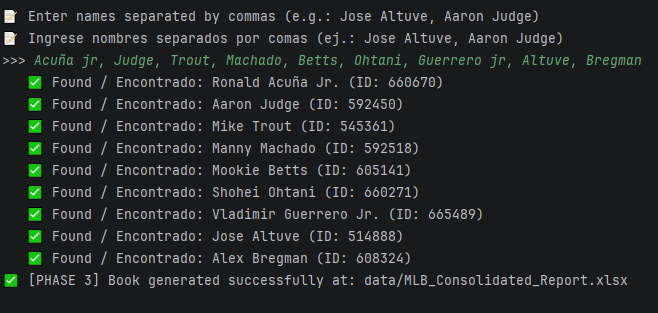
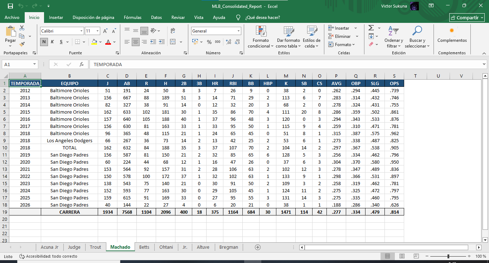

# ⚾ MLB Stats Master Pro

  <a href="#-español">🇪🇸 Español</a> | <a href="#-english">🇺🇸 English</a> 

---

## 🇪🇸 Español

### 📌 Descripción
MLB Stats Master Pro es una herramienta avanzada de automatización diseñada para la extracción, procesamiento y análisis de estadísticas de jugadores de las Grandes Ligas (MLB). Utilizando la StatsAPI oficial, el sistema genera reportes profesionales en Excel con un enfoque en la eficiencia y la precisión de datos históricos de bateo.

### ⚙️ Funcionalidades
* 🔎 **Búsqueda Dinámica:** Localización de IDs de jugadores en tiempo real mediante búsqueda por nombre.
* 📊 **Procesamiento Masivo:** Generación de múltiples reportes individuales en una sola ejecución.
* 📖 **Libro Consolidado:** Creación de archivos Excel maestros con múltiples pestañas y formato profesional.
* 🧹 **Mantenimiento Integrado:** Sistema de limpieza automática de la carpeta de resultados (`/data`).
* 🟢 **Optimización de Formato:** Supresión automática de errores de Excel (triángulos verdes).

### 🧠 Arquitectura del Software
* `main.py`: Orquestador principal con menú interactivo y bilingüe.
* `src/api/`: Cliente de conexión con la StatsAPI de MLB.
* `src/core/`: Motores de procesamiento de estadísticas y cálculo de totales de carrera.
* `src/pipeline/`: Lógica de integración de las 3 fases del proyecto.
* `src/export/`: Gestor de exportación y diseño corporativo de Excel.

### 📦 Instalación
1. `git clone https://github.com/tu-usuario/MLB_Stats_Master_Pro.git`
2. `cd MLB_Stats_Master_Pro`
3. `pip install -r requirements.txt`

### 🚀 Uso
1. Ejecuta el sistema: `python main.py`.
2. Selecciona la opción deseada (Individual, Masivo o Libro Consolidado).
3. Ingresa los nombres de los jugadores separados por comas.

### 📸 Resultados
📊 **Proceso en Consola:**

📄 **Reporte Excel Profesional (Optimización de formato y limpieza de celdas):**

---

## 🇺🇸 English

### 📌 Description
MLB Stats Master Pro is an advanced automation tool designed for the extraction, processing, and analysis of Major League Baseball (MLB) player statistics. Utilizing the official StatsAPI, the system generates professional Excel reports focusing on efficiency and the accuracy of historical hitting data.

### ⚙️ Features
* 🔎 **Dynamic Search:** Real-time player ID location via name search.
* 📊 **Bulk Processing:** Generation of multiple individual reports in a single execution.
* 📖 **Consolidated Workbook:** Creation of master Excel files with multiple tabs and professional formatting.
* 🧹 **Integrated Maintenance:** Automatic cleanup system for the results folder (`/data`).
* 🟢 **Formatting Optimization:** Automatic suppression of Excel errors (green triangles).

### 🧠 Software Architecture
* `main.py`: Main orchestrator with an interactive bilingual menu.
* `src/api/`: MLB StatsAPI connection client.
* `src/core/`: Stats processing engines and career totals calculation.
* `src/pipeline/`: Integration logic for the 3 project phases.
* `src/export/`: Export manager and corporate Excel design.

### 📦 Installation
1. `git clone https://github.com/your-username/MLB_Stats_Master_Pro.git`
2. `cd MLB_Stats_Master_Pro`
3. `pip install -r requirements.txt`

### 🚀 Usage
1. Run the system: `python main.py`.
2. Select the desired option (Individual, Bulk, or Consolidated Workbook).
3. Enter player names separated by commas.

### 📸 Output
📊 **Console Process:**

📄 **Professional Excel Report:**

---
### 👨‍💻 Autor / Author
**VICTOR ARMANDO DE OLIVEIRA RODRÍGUEZ**
